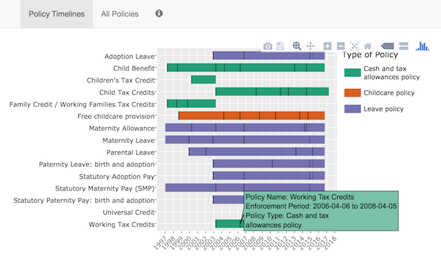

# Oxford Family Policy Database

The Oxford Family Policy Database is a project funded by the University of Oxford John Fell fund to provide information on the social policies for families, employment-related leave and childcare in the UK.

This GitHub repository contains a Shiny app that provides an interactive Gantt chart to allow readers to interactive explore the Family Policy Database. You can find the app here - http://familypolicyox.web.ox.ac.uk/policies_dataset

The academic contact for this work is (Dr. Mireia Borrell-Porta)[http://orcid.org/0000-0003-2328-1258].

</img>

This code has been deposited on Figshare: http://doi.org/10.6084/m9.figshare.5539942